= Anwenderdokumentation: elektronisches Logbuch

[%always]
<<<

. Webapp aufrufen
. Accountanmeldung
. Flugeintrag anlegen
.. Flugeintrag beginnen
.. Flugeintrag beenden
. Flugeinträge einsehen
. Aktive Piloten einsehen
. Flugleiter
. Tagesprotokoll anlegen
. Nutzerverwaltung in der Webapp

Zuständige Personen:

- Herr Professor Doktor Iwe
- Herr Römer

[%always]
<<<

## 1. Aufruf der Webapp
Die Webbapp ist entweder von der Webseite des Modellflugvereins aufrufbar oder kann durch das Scannen des ausgehängten QR-Codes auf dem Flugplatz erreicht werden. Es wird ein internetfähiges Smartphone benötigt.

## 2. Accountanmeldung
Wenn Sie als Nutzer im System eingetragen sind, wird Ihnen Ihr Admin die Daten für einen Erstzugang geben. Wenn Sie sich das erste Mal anmelden, wird das erste Passwort das Sie eingeben, Ihr zukünftiges Passwort. Bitte beachten Sie, dass das Passwort mindestens 6 Zeichen haben muss.

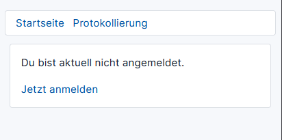
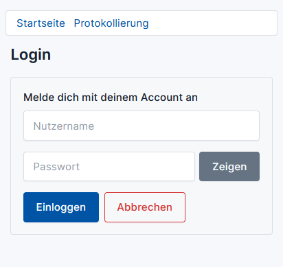

Hinweis: Falls Sie Ihr Passwort vergessen haben, richten Sie sich bitte an eine zuständige Person. Diese setzt Ihr Passwort zurück. Daraufhin können Sie sich wie oben beschrieben anmelden.

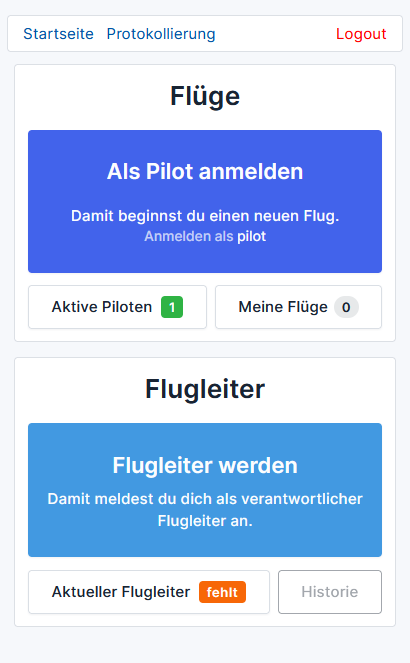

## 3. Flugeinträge anlegen
Einen Flugeintrag sollte beim Antreten einer Flugsitzung erstellt werden.
Sollte es nötig sein, dann ist ein Flugeintrag auch im Nachhinein anlegbar. Am Ende des Tages werden alle Flugeinträge aller an diesem Tag anwesenden Piloten automatisch zu einem Flugprotokoll zusammengefasst.

### a. Flugeintrag beginnen 
Durch das Betätigen des Buttons “Als Pilot anmelden”, öffnet sich eine Formularansicht, in der man alle benötigten Daten für einen Flugeintrag eintragen kann. Pflichtangaben sind die Folgenden: Datum, Uhrzeit Flugbeginn, Flugzeugtyp und Unterschrift.
Weiterhin können Angaben zur Überprüfung der Erste-Hilfe-Station getätigt werden.

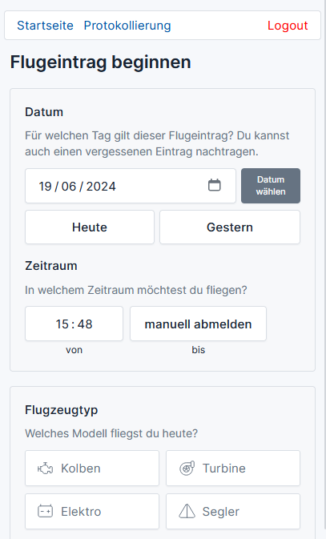
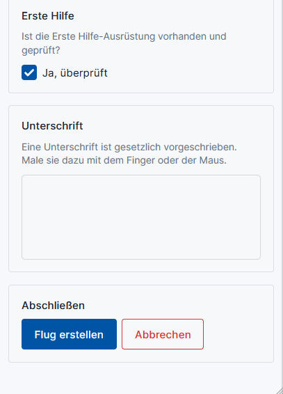

### b. Flugeintrag beenden
Wenn ein Flug begonnen wurde, dann wird die Schaltfläche "Als Pilot anmelden" durch "Als Pilot abmelden" ersetzt. Durch das Betätigen dieser kann man nun den Flugeintrag abschließen. Abschließend kann man zudem noch Bemerkungen anhängen, wenn Bedarf besteht.

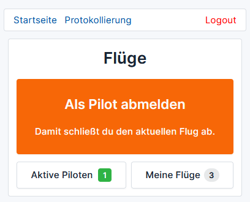
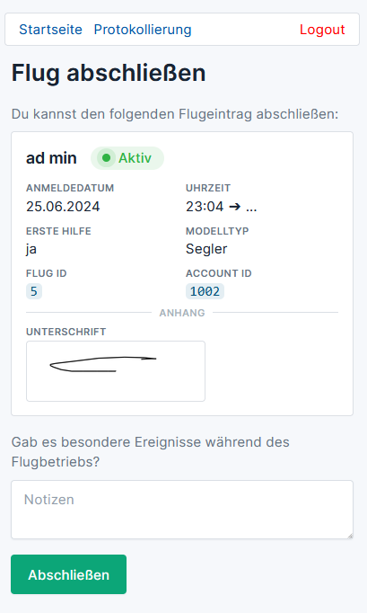

## 4. Flugeinträge einsehen
Über die Schaltfläche "Meine Flüge" können Sie sich alle Ihre erstellten Flugeinträge ansehen.

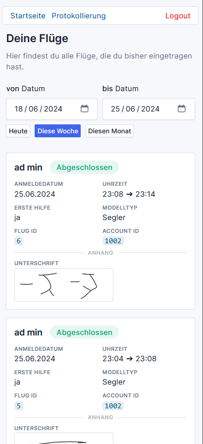

## 5. Aktive Piloten einsehen
Über die Schaltfläche "Aktive Piloten" können Sie sich alle aktiven Piloten anzeigen lassen.

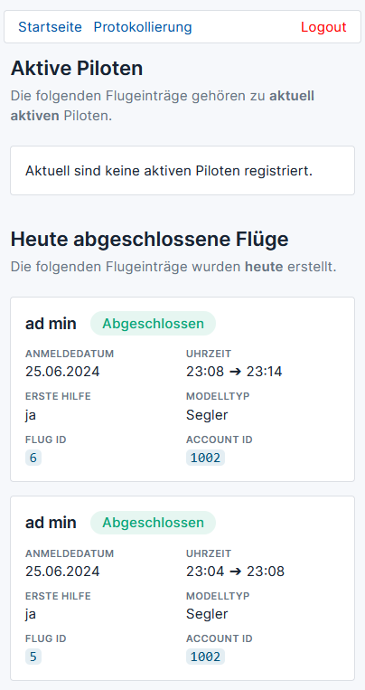

## 6. Flugleiter
Mit der Schaltfläche "Flugleiter werden" können Sie sich als Flugleiter melden. Solange kein Flugleiter anwesend ist, ist das an der Anzeigefläche "Aktueller Flugleiter fehlt" zu erkennen.
Nach Betätigen der Schaltfläche "Flugleiter werden" muss dies noch ebstätigt werden. Danach ist man als Flugleiter eingetragen.

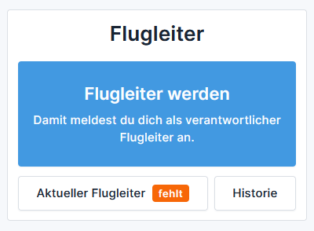

Solange die Anzahl der Piloten unter drei liegt, darf ein Flugleiter noch fliegen. 
Ab einer Anzahl von 3 Piloten ändert sich das jedoch. Dann darf der Flugleiter nicht mehr selbst fliegen. Um wieder fliegen zu dürfen, muss ein Pilot die Flugleiterrolle an einen anderen Piloten abgeben.
Wenn man Flugleiter ist, kann man sich über die Schaltfläche "Als Flugleiter abmelden" wieder abmelden.
Wenn ein Flugleiter anwesend ist, kann dieser durch Betätigen der Schaltfläche "Aktueller Flugleiter präsent" angezeigt werden.

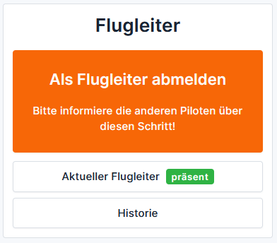
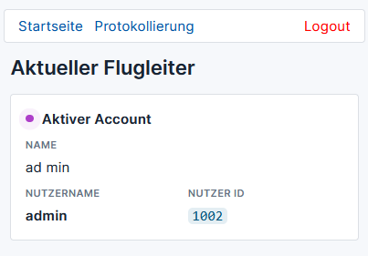

Über die Schaltfläche "Historie" kann angezeigt werden, wer in der Vergangenheit Flugleiter war.

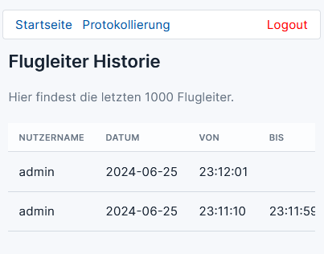

## 7. Tagesprotokoll anlegen
Über die Verlinkung Protokollierung am oberen Ende des Hauptmenüs kann ein Benutzer mit mindestens der Berechtigung "Protokolleur" ein Tagesprotokoll aus den Flugeinträgen eines Tages erstellen lassen. Er kann einen beliebigen Tag in der Vergangenheit auswählen.

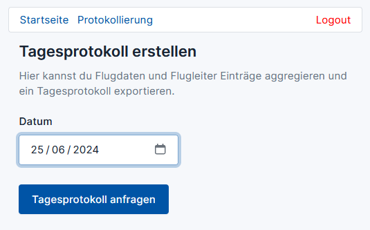

Nach Betätigen der Schaltfläche "Tagesprotokoll anfragen", werden die Flugeinträge zusammengefasst und ein Tagesprotokoll erstellt. Dieses wird dann in der Druckansicht geöffnet. Man kann es sowohl ausdrucken lassen, als auch als PDF speichern.

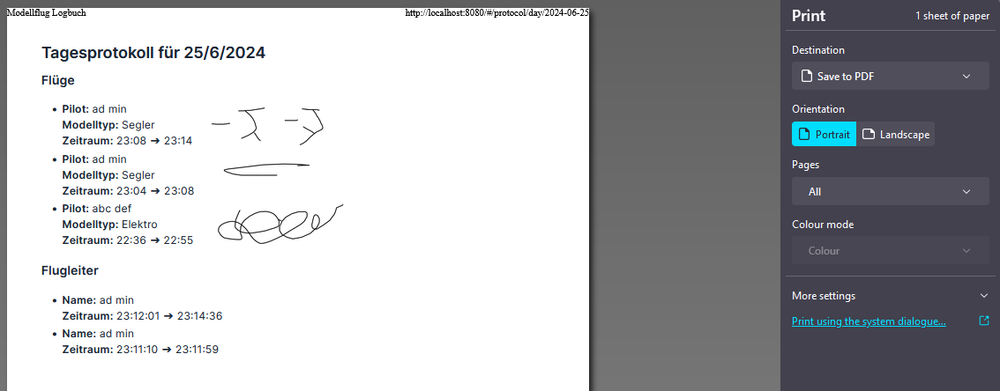

[%always]
<<<

## 8. Nutzerverwaltung in der Webapp
Nutzern mit Adminrechten ist es möglich innerhalb der Webapp die Nutzerverwaltung durchzuführen. Sie kann über die Schaltfläche "Nutzerverwaltung" aufgerufen werden.

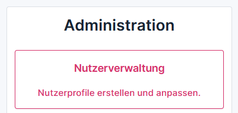

Hier können über die Schaltfläche "+ Neuer Nutzer" ein neuer Nutzer erstellt werden.

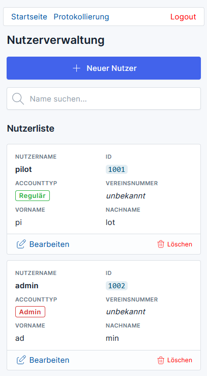

Es öffnet sich eine Formularansicht und es können folgende Daten eingegeben werden:
Nutzernamen, Passwort, Vorname. Nachname, Vereinsnummer und Berechtigungsrolle.

Wenn das Passwort nicht eingegeben wird, dann wird das erste Passwort, dass der Benutzer beim Anmelden verwendet als Passwort gesetzt.

Wird keine Berechtigungsrolle ausgewählt, dann wird die Rolle "Regulär" gesetzt. Ansonsten sind die Berechtigungsrollen "Administrator" und "alle Protokolle sehen", also "Protokolleur", auswählbar.
Protokolleure haben die gleichen Berechtigungen wie Regulär, können aber zusätzlich Tagesprotokolle erstellen und alle Flugeinträge einsehen.
Administratoren haben alle Berechtigungen wie Regulär und Protokolleur, können aber zusätzlich Nutzer erstellen, bearbeiten und löschen.

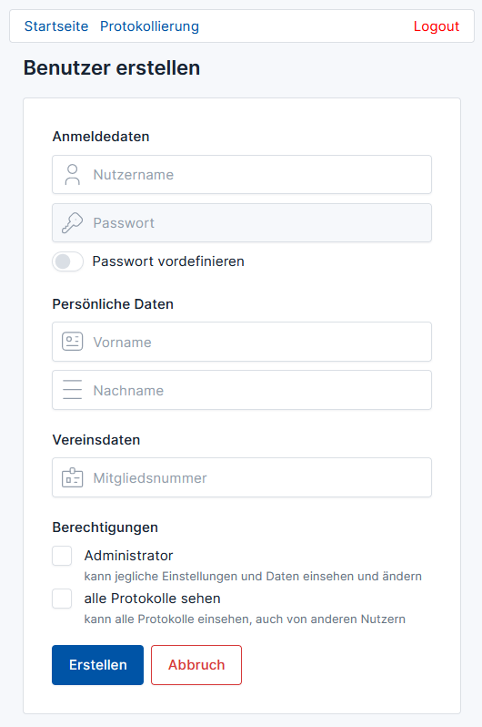

Bereits bestehende Nutzer können zudem bearbeitet oder gelöscht werden.

= FAQ

### Wie kann ich mich registrieren?
Ein Admin muss einen Account für Sie erstellen. Sobald er Ihnen Ihre Anmeldedaten gegeben hat, können Sie sich anmelden.

### Wie kann ich einen Flugeintrag anlegen?
Sobald Sie sich angemeldet haben, können Sie über die Schaltfläche "Als Pilot anmelden" einen Flugeintrag erstellen.

### Wie kann ich ein Tagesprotokoll erstellen?
Wenn Sie die Berechtigung "Protokolleur" oder "Administrator" besitzen, können Sie am oberen Ende des Hauptmenüs über "Protokollierung" und anschließend auf "Tagesprotokoll erstellen" ein Tagesprotokoll erstellen. Es wird in der Druckansicht geöffnet und kann ausgedruckt oder als PDF gespeichert werden.

### Wie kann ich einen neuen Nutzer erstellen?
Wenn Sie die Berechtigung "Administrator" besitzen, können Sie im Hauptmenü weiter unten über die Schaltfläche "Nutzerverwaltung" die Nutzerverwaltung aufrufen. Durch Betätigen der Schaltfläche "+ Neuer Nutzer" wird eine Formularansicht geöffnet, über die Sie einen neuen Nutzer erstellen können.

