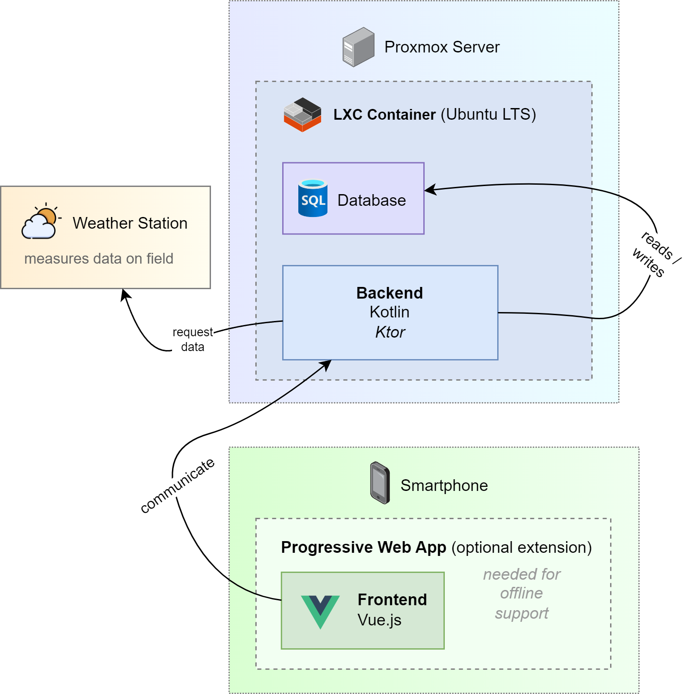

# Mobiles Logbuch Modellflugplatz

> Die gesetzliche Vorgabe für den Betrieb eines Modellflugplatzes beinhaltet
bürokratische Maßnah­men, einschließlich der Pflicht, ein zentrales Logbuch 
für die Piloten zu führen. Die bisherigen Bemühungen, dies effektiv 
umzusetzen, stellten sich als herausfordernd heraus, besonders unter
Berücksichtigung des Energieverbrauchs der existierenden
Wetterstationsinfrastruktur.
> 
> Ein moder­ner Ansatz, der die Mobilität und Konnektivität von Smartphones nutzt und auf der effizienten Container-Technologie eines Proxmox-Servers basiert, kann hier eine nachhaltige Lösung bieten.

Dieses Repository entsteht im Rahmen des Moduls Software Engineering I und II unter dem Thema *"Mobiles Logbuch für den Modellflugplatz des Mfc-Rossendorf mittels
Smartphone der Piloten"*.

## Linkverzeichnis

- [**Betriebsdokumentation** inklusive Deployment Guide](belegabgabe_se2/Betriebsdokumentation/Betriebsdokumentation.adoc)
- [Entwicklerdokumentation](belegabgabe_se2/Entwicklerdokumentation.adoc)
- [Work Item List](https://github.com/users/jakobkmar/projects/2/views/3)
- [Ursprüngliche README.md](readme_old.md)

## Architecture



## Aufbau des Repositories

```tree
.
├── belegabgabe_se1
├── belegabgabe_se2
├── docs
│   ├── architecture
│   ├── development
│   ├── deployment
│   ├── requirements
│   ├── project_management
│   └── test
└── src
    ├── backend
    └── frontend
```

## Lizenz

This repository is licensed under the [Apache 2.0 License](https://www.apache.org/licenses/LICENSE-2.0). Individual subdirectories may be subject to other free licenses.
